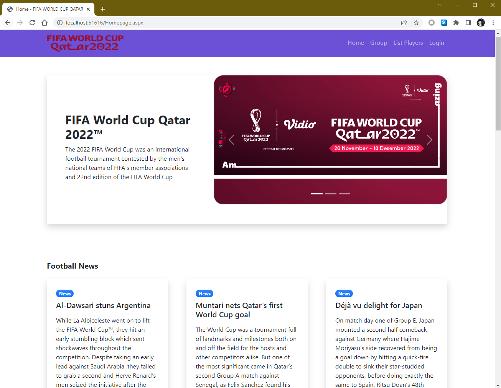

## 👋 Hey everyone, Don't forget to give our project a star 👋

# SCSJ3253 - PROGRAMMING TECHNIQUE III
## PROJECT - QATAR 2022 FIFA WORLD CUP PLAYERS LIST

### About Us
We are made up of four members who have various job backgrounds. In this semester, we are united in the subject of Programming Techniques III. PM DR TS MOHD SHAHIZAN BIN OTHMAN, is a cool lecturer and never gets tired of teaching us especially in ASP.Net programming

From left: Nazariah, Ashikin, PM Dr. Ts Mohd Shahizan, Mazrizal and Charlene

### Summary of the Project
Many people are interested in and watch football matches all over the world. One of them is FIFA World Cup Qatar 2022™ takes place from November 20 to December 18, 2022. There are 32 teams from around the world who will compete in 64 matches.

Therefore, we have developed a system for fans to know the players of the team by Country. This system is developed using ASP.NET web programming along with Microsoft Visual Studio 2022 which is used to edit, debug, and build code, and then publish an app.

### Project Module

There are three Main Pages which are the Super Admin, Admin and the User (default) Page. There are three main modules which are News, Groups and List Player by Country. For the user page, the latest news information, a list of countries and a list of players by country are displayed. As for the admin page, the admin will manage information related to news, the list of players according to the country chosen by the user and groups. As for the super admin page, the super admin will manage all admins and super admins information. Please see the user manual attached in our project.

### Member's Task

All members will commit the results of the project using github provided by Dr. Shahizan.

1. Nazariah - Commit Web Design Code (User + Admin Page) & User Manual.
2. Mazrizal - Commit Database Design & Commit Picture of Players (Full total of World Cup player = 883 with detail informations).
3. Charlene - Commit Database Connection (SQL QUERY) Code for all pages, add CRUD for news, groups and list player, extract SQL dump.
4. Ashikin - Commit Final Report.

### Task completed 
1. User Manual - 28/1/2023
2. Source Code Project - 28/01/2023
3. Report - 31/1/2023

### Full Picture Team Player
1. Argentina - World Cup Champion!!!
2. France
3. Croatia
4. Marocco
