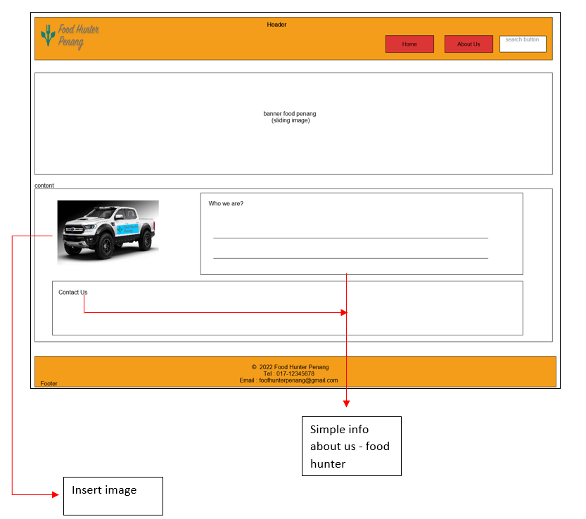

# SCSJ3253
# PROGRAMMING TECHNIQUE III
## REPORT FOR ASSIGNMENT 4 (WEB DESIGN)

1 SITI NAZARIAH BINTI ABDUL RAHMAN SX161507CSJF01

2 MAZRIZAL BINTI ABDULLAH SX181730CSJF04

3 CHARLENE NG ANDREW SX180355CSJS04

4 NIK NUR ASHIKIN BINTI MEGAT SHAIDI SX170113CSJS04

## Tasks
This assignment requires you to complete a project using the concepts of Master
Pages, Skins and Themes.
- You need to use Bootstrap to complete this task.
- The Malaysian culture is essential to this project's concept.

### Design Mock-up Web Design

### Homepage

If user, click Top 10 "Halal" Food in Penang or Top 10 "Non-Halal" Food in Penang, this page as below 
(refer homepage design)

### About Us Menu

### Source Code
Please refer to the attachment file upload in e-learning portal

### 3. Design Interface
### Homepage

### About Us

### Top 10 "Halal" Food in Penang

### Top 10 "Non" Halal Food in Penang

